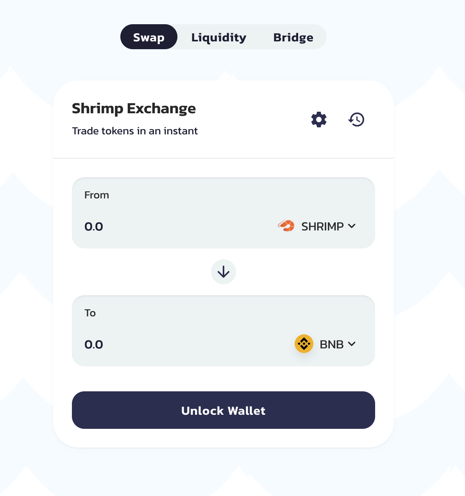
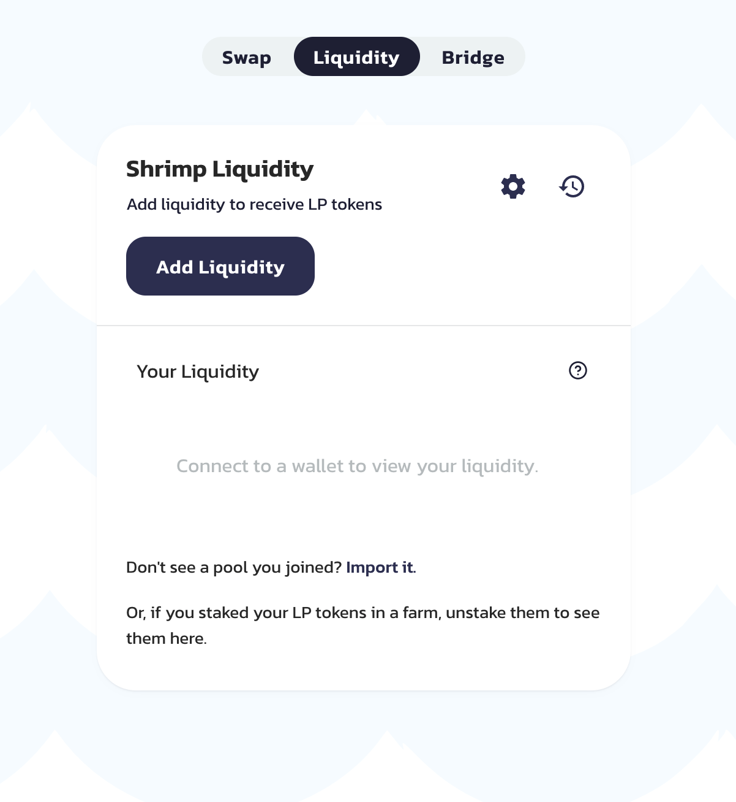

# Exchange

[**Token swaps**](https://exchange.shrimpswap.finance/#/swap) on ShrimpSwap are a simple way to trade one BEP-20 token for another via automated liquidity pools. In the backend of the exchange we are using [PancakeSwap](https://pancakeswap.finance/).

The liquidity provided to the exchange comes from Liquidity Providers \("LPs"\) who stake their tokens in "Pools". In exchange, they get FLIP \(ShrimpSwap Liquidity Provider\) tokens, which can also be staked to earn SHRIMP tokens in the "farm".

When you make a token swap \(trade\) on the exchange you will pay a **0.2% trading fee**, which is broken down as follows:

**0.17%** - Returned to liquidity pools in the form of a fee reward for liquidity providers.

**0.03%** - Sent to the PancakeSwap Treasury.
