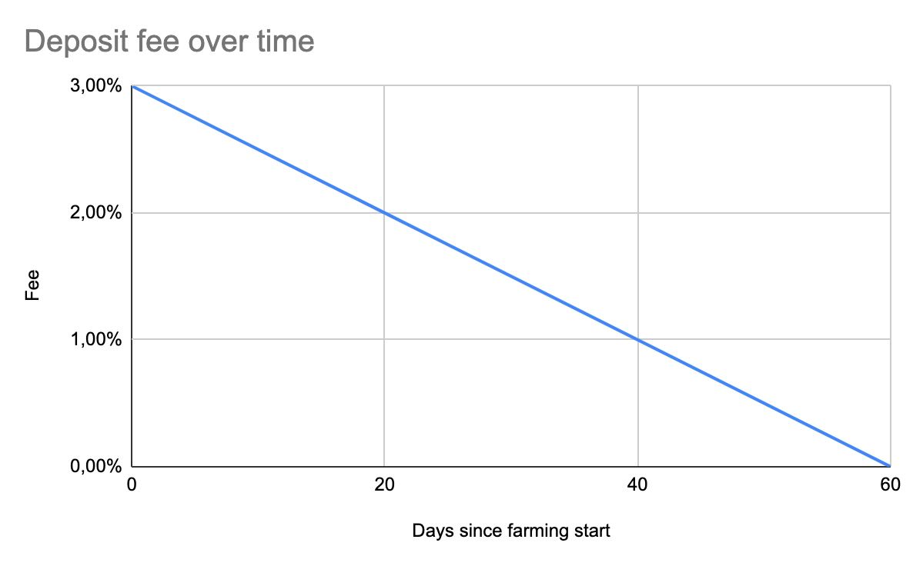

# SHRIMP Deflationary token

We believe that the current yield farm ecosystem is suffering from hyperdeflation, i.e. the extremely large decrease in the general prices of tokens in the blockchain. This results in a deflationary spiral which leads to less appreciation of the token, lower Annual Percentage Rates (APRs) and lower demand for the tokens in general, and thus deposit levels. This scenario creates a deflationary environment which does not serve the interests of the parties involved.

In order to solve this problem we have developed a contract in the Binance Smart Chain to combat the endemic hyperdeflation of the ecosystem and increase investor confidence; introducing the **SHRIMP deflationary token**. We capped the maximum supply to 21M SHRIMPS.

## Shrimp boils down to these fundamentals

The deposit fee will be reduced over time, initially set to 3% it will reach 0% at the end of 60 days.

In the same vein, the number of rewards will also decrease with time. They will start at 21.875 SHRIMP per block and will be reduced gradually to zero at the end of the 60 day period.

Therefore, we will have a maximum supply limit of 21M SHRIMP tokens, limiting the circulation and guarantee that no further single unit of SHRIMP will be released. An identical concept was released in the Ethereum blockchain by [yearn.finance](https://yearn.finance/) (YFI) and BTC.

